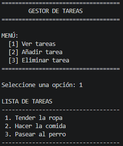
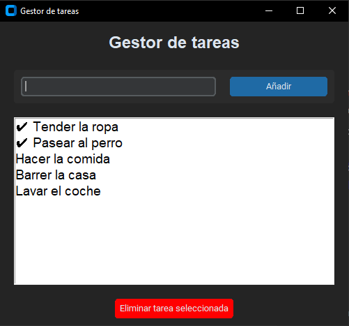

# Gestor de Tareas en Python

Este proyecto contiene **dos versiones de un gestor de tareas en Python**:  
1. **Versión de terminal**  
2. **Versión con interfaz gráfica (GUI)** usando `customtkinter`.

---

## 1. Versión de Terminal

### Descripción
Permite gestionar tareas desde la terminal de manera sencilla. Puedes ver, añadir y eliminar tareas rápidamente.

### Funcionalidades
- Ver la lista de tareas.
- Añadir nuevas tareas.
- Eliminar tareas por número.
- Manejo de errores para entradas inválidas.

### Captura de pantalla


---

## 2. Versión con Interfaz Gráfica (GUI)

### Descripción
Utiliza `customtkinter` para ofrecer una interfaz visual interactiva. Permite:

- Visualizar todas las tareas en una lista.
- Añadir nuevas tareas mediante un cuadro de entrada.
- Eliminar tareas seleccionadas.
- Marcar tareas como completadas haciendo doble clic.
- Guardar y cargar tareas automáticamente desde `GUI/tareas.json`.

### Captura de pantalla


---

## Requisitos

- Python 3.7 o superior
- Paquete `customtkinter`:

```bash
pip install customtkinter
